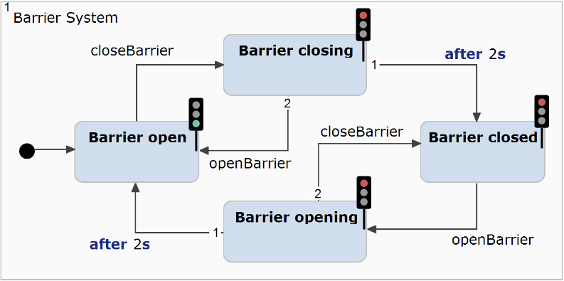
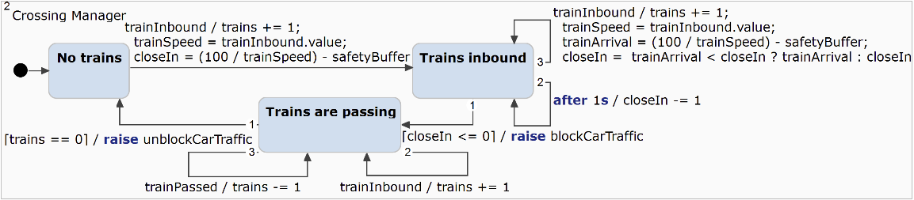

# Detailed comparison with to other approaches (preliminary work of the authors)

To show how our work (classified as coordination framework) differs from existing approaches such as ADLs, coordination languages, and co-simulation approaches, we created the following overview:


We can see in the overview that shows the abstraction levels that most approaches operate on the model or execution level, while our approach operates on the language level.
Our approach operates on the language level to coordinate **heterogeneous** systems. For example, approaches on the model level require that each part of a system must be given in the chosen modeling language.
For example, ADLs often use process algebras, which would require translating the models in our example into the chosen process algebra.

## Feature model
The following image shows a feature model to compare coordination approaches, such as ADLs, coordination languages, coordination frameworks (like this publication) and even co-simulation approaches.
Especially, the component languages part in the bottom right shows the differentiation between homogeneous/heterogeneous. For example, ADLs have homogeneous components, while our approach allows heterogeneous modeling languages.


The feature model is currently unpublished, so we did not explain all details or describe our methodology.

# Maude Implementation

The implementation of our approach in Maude and its application to the use case is described in these artifacts.

## Prerequisites

1. **Install Maude** 3.5 or higher according to the [installation instructions](https://maude.cs.illinois.edu/wiki/Maude_download_and_installation).
   To run Maude on Windows, we recommend the [Windows Subsystem for Linux (WSL)](https://learn.microsoft.com/en-us/windows/wsl/install).

2. **Test your Maude installation** by running the following command (WSL or Linux):
```bash
maude
```

It should return the following (Version 3.5 or higher):

```text
❯ maude
                     \||||||||||||||||||/
                   --- Welcome to Maude ---
                     /||||||||||||||||||\
             Maude 3.5 built: Sep 25 2024 12:00:00
             Copyright 1997-2024 SRI International
                   Sun Mar 30 10:11:50 2025
```

You can use **q** to exit maude.

## Overview

The subfolders contain the following information:

- **bpmn**: Contains BPMN semantics implemented in Maude which are integrated into our approach but not discussed in the paper.
- **broker**: Contains the implementation of the broker metamodel and language adapters in _broker-def.maude_, the application of our implementation to the use case in _use-case_, and some simpler examples of coordination between heterogeneous languages in _examples_.
- **common**: Contains the definition of the overall system in Maude including the global clock and time advancement (**tick rule**) in _common.maude_.
- **cpn**: Contains the implementation of CPN semantics (only a subset) in Maude along with various simple examples to test the implementation.
- **lts**: Contains an implementation of labeled transition systems (LTS) in Maude, which exposed synchronous communication, which we also investigated and integrated into our framework. However, these preliminary results are not discussed in the paper.
- **statechart**: Contains the implementation of SC semantics (only a subset) in Maude along with various simple examples to test the implementation.

## Use case

Run the verification of the use case properties using the following command.
```bash
cd broker/use-case
maude run-use-case.maude
```

<details>
  <summary>Click to see output</summary>

  ```text
❯ maude run-use-case.maude
                     \||||||||||||||||||/
                   --- Welcome to Maude ---
                     /||||||||||||||||||\
             Maude 3.5 built: Sep 25 2024 12:00:00
             Copyright 1997-2024 SRI International
                   Sun Mar 30 20:31:23 2025
==========================================
reduce in MODEL-CHECK : modelCheck(systemConfiguration, []~ Train-count-negative) .
rewrites: 23130 in 20ms cpu (20ms real) (1156500 rewrites/second)
result Bool: true
==========================================
reduce in MODEL-CHECK : modelCheck(systemConfiguration, []~ (Train-passing /\ Barriers-open)) .
rewrites: 22731 in 20ms cpu (17ms real) (1136550 rewrites/second)
result Bool: true
==========================================
reduce in MODEL-CHECK : modelCheck(systemConfiguration, []~ (Train-passing /\ Barrier-closing)) .
rewrites: 22731 in 10ms cpu (16ms real) (2273100 rewrites/second)
result Bool: true
==========================================
reduce in MODEL-CHECK : modelCheck(systemConfiguration, [](Barriers-closed -> <> Barriers-open)) .
rewrites: 22920 in 20ms cpu (16ms real) (1146000 rewrites/second)
result Bool: true
==========================================
reduce in MODEL-CHECK : modelCheck(systemConfiguration, [](Train-Inbound-Packet -> <> Barriers-closed)) .
rewrites: 22964 in 20ms cpu (16ms real) (1148200 rewrites/second)
result Bool: true
==========================================
search in MODEL-CHECK : systemConfiguration =>! S .

Solution 1 (state 403)
states: 404  rewrites: 22315 in 10ms cpu (16ms real) (2231500 rewrites/second)
S --> {< a : CPN |
  places : (place("New train can approach", "New train delay passed -> New train can approach",
    "New train can approach -> Inbound train measured", INT), place("New train waiting to approach",
    "Outgoing train measured -> New train waiting to approach",
    "New train waiting to approach -> New train delay passed", INT), place("Train between sensors",
    "Inbound train measured -> Train between sensors", "Train between sensors -> Outgoing train measured",
    INT), place("Train inbound", "Inbound train measured -> Train approaching", empty, INT), place(
    "Train passed", "Outgoing train measured -> Train passed", empty, INT)),
  transitions : (transition("Inbound train measured", "New train can approach -> Inbound train measured", (
    "Inbound train measured -> Train approaching", "Inbound train measured -> Train between sensors"), @+
    const(0)), transition("New train delay passed",
    "New train waiting to approach -> New train delay passed",
    "New train delay passed -> New train can approach", @+ const(10)), transition(
    "Outgoing train measured", "Train between sensors -> Outgoing train measured", (
    "Outgoing train measured -> New train waiting to approach", "Outgoing train measured -> Train passed"),
    @+ (const(400) /' speed))),
  arcs : (arc("Inbound train measured -> Train approaching", "Inbound train measured", "Train inbound",
    varExpression(speed)), arc("Inbound train measured -> Train between sensors", "Inbound train measured",
    "Train between sensors", varExpression(speed)), arc("New train can approach -> Inbound train measured",
    "New train can approach", "Inbound train measured", varExpression(speed)), arc(
    "New train delay passed -> New train can approach", "New train delay passed", "New train can approach",
    varExpression(speed)), arc("New train waiting to approach -> New train delay passed",
    "New train waiting to approach", "New train delay passed", varExpression(speed)), arc(
    "Outgoing train measured -> New train waiting to approach", "Outgoing train measured",
    "New train waiting to approach", varExpression(speed)), arc("Outgoing train measured -> Train passed",
    "Outgoing train measured", "Train passed", varExpression(speed)), arc(
    "Train between sensors -> Outgoing train measured", "Train between sensors", "Outgoing train measured",
    varExpression(speed))) >
< ai : CPNInstance |
  cpn : a,
  marking : (token("New train can approach", data(25), 78), token("New train can approach", data(40), 80))
    >
< barrierSystem : StateChart |
  transitions : ("Barrier closed" - event("openBarrier") / noEffect -> "Barrier opening", "Barrier closing"
    - event("openBarrier") / noEffect -> "Barrier open", "Barrier closing" - after(2) / noEffect ->
    "Barrier closed", "Barrier open" - event("closeBarrier") / noEffect -> "Barrier closing",
    "Barrier opening" - event("closeBarrier") / noEffect -> "Barrier closed", "Barrier opening" - after(2)
    / noEffect -> "Barrier open") >
< bsi : SCInstance |
  sc : barrierSystem,
  state : scToken("Barrier open", 0),
  variables : none >
< crossingManager : StateChart |
  transitions : ("No trains" - event("trainInbound") / trainSpeed = "trainInbound" . value ; (trains =
    trains +' 1 ; (closeIn = trainSpeed /' 200 ; closeIn = closeIn -' safetyBuffer)) -> "Trains inbound",
    "Trains are passing" - event("trainInbound") / trains = trains +' 1 -> "Trains are passing",
    "Trains are passing" - event("trainPassed") / trains = trains -' 1 -> "Trains are passing",
    "Trains are passing" - [trains == 0] / raise "unblockCarTraffic" ; (trainSpeed = 0 ; (trainArrival = 0
    ; closeIn = 0)) -> "No trains", "Trains inbound" - event("trainInbound") / trainSpeed = "trainInbound"
    . value ; (trains = trains +' 1 ; (trainArrival = trainSpeed /' 200 ; (trainArrival = closeIn -'
    safetyBuffer ; closeIn = trainArrival <' closeIn ? trainArrival : closeIn))) -> "Trains inbound",
    "Trains inbound" - [closeIn <=' 0] / raise "blockCarTraffic" -> "Trains are passing", "Trains inbound"
    - after(1)[closeIn >=' 1] / closeIn = closeIn -' 1 -> "Trains inbound") >
< cmi : SCInstance |
  sc : crossingManager,
  state : scToken("No trains", 2),
  variables : ([closeIn : 0], [trains : 0], [trainSpeed : 0], [trainArrival : 0], [safetyBuffer : 1]) >
< pools : EventPools |
  pools : (evpool("blockCarTraffic", nil), evpool("closeBarrier", nil), evpool("openBarrier", nil), evpool(
    "trainInbound", nil), evpool("trainPassed", nil), evpool("unblockCarTraffic", nil)) >
< br : Broker |
  in : noPackets,
  out : noPackets,
  bindings : ("Train inbound" -> "trainInbound", "Train passed" -> "trainPassed", "blockCarTraffic" ->
    "closeBarrier", "unblockCarTraffic" -> "openBarrier") >, 72}

No more solutions.
states: 404  rewrites: 22315 in 10ms cpu (16ms real) (2231500 rewrites/second)
Maude>
```
</details>

Make sure to have the most-recent Maude version installed (we used **Maude 3.5**).
A more detailed breakdown of the use case implementation and verification is given [here](./broker/use-case/README.md).

### CPN model
CPN model. See executable source of the model for **CPN Tools** [here](./cpn/examples/source/sensor-system.cpn).


### Barrier System SC model.



Executable file for **itemis CREATE** available [here](./broker/use-case/images/barrier-system-crossing-manager.ysc).

### Crossing Manager SC model.



Executable file for **itemis CREATE** available [here](./broker/use-case/images/barrier-system-crossing-manager.ysc).

